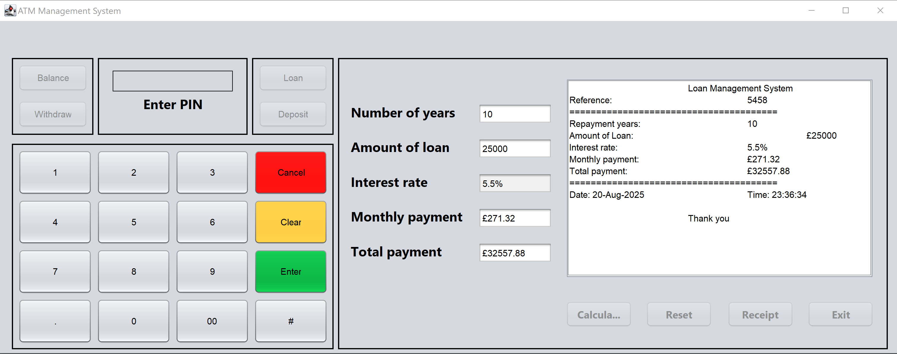

# ATM Management System

A comprehensive Java Swing-based ATM (Automated Teller Machine) simulation that provides banking operations and loan calculation functionality.

## Application Interface



*The main interface showing the PIN entry screen, numeric keypad, and loan calculation panel*

## Features

### 🔐 Security Features
- **PIN Authentication**: Secure 4-digit PIN verification (default: 1234)
- **Account Lockout**: Automatic card blocking after 3 failed PIN attempts
- **Access Control**: All functions disabled until successful authentication

### 💰 Banking Operations
- **Balance Inquiry**: Check current account balance
- **Cash Withdrawal**: Withdraw money with insufficient funds protection
- **Cash Deposit**: Deposit money to account
- **Transaction Feedback**: Real-time balance updates and confirmations

### 📊 Loan Management
- **Loan Calculator**: Calculate monthly and total payments
- **Automatic Interest Rates**: (£100k+) → 6%, (£20k-£99k) → 5.5%, (under £20k) → 5%
- **Input Validation**: Ensures all loan parameters are valid
- **Receipt Generation**: Detailed loan calculation receipts with timestamps

### 🖥️ User Interface
- **Intuitive Keypad**: Full numeric keypad with decimal point support (0-9, ., 00)
- **Color-Coded Controls**: 
  - Green "Enter" button for confirmations
  - Red "Cancel" button for exits
  - Yellow "Clear" button for resets
- **Dual-Panel Layout**: 
  - Left side: ATM operations (Balance, Withdraw, Loan, Deposit)
  - Right side: Loan calculation with receipt generation
- **Clear Display**: Large, readable transaction display with PIN status indicator
- **Status Indicators**: Real-time PIN status and system feedback
- **Professional Layout**: Clean, ATM-like interface design with bordered panels

## System Requirements

- **Java Version**: Java 8 or higher
- **GUI Framework**: Java Swing (included in JDK)
- **Memory**: Minimum 256 MB RAM
- **Operating System**: Windows, macOS, or Linux

## Usage Guide

### Initial Setup
1. **Launch the application**
2. **Enter PIN**: Use the numeric keypad to enter `1234`
3. **Press Enter**: Authenticate and unlock all features

### Banking Operations
- **Check Balance**: Click "Balance" button to view current balance (initial: £1000.00)
- **Withdraw Money**: 
  - Click "Withdraw" button
  - Enter amount in popup dialog
  - Confirm transaction
- **Deposit Money**: 
  - Click "Deposit" button
  - Enter amount in popup dialog
  - Confirm transaction

### Loan Calculations
1. **Click "Loan"** to enter loan mode
2. **Fill in the required fields**:
   - Number of years
   - Loan amount
3. **Click "Calculate Loan"** to compute payments
4. **Generate Receipt** for documentation
5. **Reset** to clear all fields

### Keypad Functions
- **Number buttons (1-9, 0)**: Input digits for PIN and amounts
- **Decimal point (.)**: Add decimal places for monetary values
- **00**: Quick double-zero input for larger amounts
- **Clear (Yellow)**: Reset display and logout from system
- **Enter (Green)**: Confirm PIN authentication or selections
- **Cancel (Red)**: Exit application with confirmation dialog
- **#**: Reserved for future functionality

## Interface Overview

The application features a professional dual-panel design:

### Left Panel - ATM Operations
- **Function Buttons**: Balance, Withdraw, Loan, Deposit
- **PIN Display Area**: Shows entered PIN (masked) and status messages
- **Numeric Keypad**: Complete 4x4 button layout with color-coded controls

### Right Panel - Loan Management  
- **Input Fields**: Interest rate, Number of years, Loan amount
- **Calculation Results**: Monthly payment, Total payment (read-only)
- **Action Buttons**: Calculate, Reset, Receipt, Exit
- **Receipt Area**: Large text area for detailed loan receipts

## Default Configuration

| Setting | Value |
|---------|-------|
| Default PIN | 1234 |
| Initial Balance | £1000.00 |
| Max PIN Attempts | 3 |
| Currency | GBP (£) |

## Security Notes

⚠️ **Important Security Information**:
- The default PIN (1234) is hardcoded for demonstration purposes
- In a production environment, PINs should be:
  - Stored securely (encrypted/hashed)
  - Retrieved from a secure database
  - Never hardcoded in source code
- Account lockout requires manual reset (contact bank simulation)

## Error Handling

The system includes comprehensive error handling for:
- **Invalid PIN entries** with attempt tracking
- **Insufficient funds** protection
- **Invalid input validation** for all numeric fields
- **Empty field validation** for loan calculations
- **Mathematical errors** in loan computations

## Technical Architecture

### Core Components
- **ATMS.java**: Main application class with GUI and business logic
- **Swing Components**: Professional UI with panels and controls
- **Event Handling**: Comprehensive button and input event management
- **Input Validation**: Robust data validation for all user inputs

### Key Classes & Methods
- `jbtnEnterActionPerformed()`: PIN authentication logic
- `jbtnBalanceActionPerformed()`: Balance inquiry
- `jbtnWithdrawActionPerformed()`: Withdrawal processing
- `jbtnDepositActionPerformed()`: Deposit processing
- `jLoanCalActionPerformed()`: Loan calculation engine
- `jReceiptActionPerformed()`: Receipt generation

## Loan Calculation Formula

The system uses the standard loan payment formula:

```
Monthly Payment = P × r × (1 + r)^n / ((1 + r)^n - 1)
```

Where:
- P = Principal loan amount
- r = Monthly interest rate (annual rate / 12 / 100)
- n = Total number of payments (years × 12)

For zero-interest loans: `Monthly Payment = Principal / Number of Months`

## Future Enhancements

### Planned Features
- [ ] Database integration for account management
- [ ] Multiple account support
- [ ] Transaction history logging
- [ ] Network connectivity for real-time processing
- [ ] Enhanced security with encryption
- [ ] Mobile-responsive design
- [ ] Multi-language support
- [ ] Advanced loan products

### Potential Improvements
- [ ] Configurable PIN requirements
- [ ] Custom currency support
- [ ] Receipt printing functionality
- [ ] Account statement generation
- [ ] Transfer between accounts
- [ ] Bill payment integration

## Troubleshooting

### Common Issues

**Application won't start**:
- Verify Java installation: `java -version`
- Check classpath configuration
- Ensure all files are in correct directories

**PIN not accepted**:
- Default PIN is `1234`
- Check for numeric input only
- Verify Enter button functionality

**Loan calculations incorrect**:
- Verify all fields contain valid positive numbers
- Check for proper decimal formatting
- Ensure interest rate is annual percentage

**Display issues**:
- Check system display scaling
- Verify Swing/AWT compatibility
- Update Java to latest version

## Contributing

This project is designed for educational purposes. To contribute:

1. Fork the repository
2. Create a feature branch
3. Implement improvements
4. Test thoroughly
5. Submit pull request with detailed description

## License

This project is provided for educational and demonstration purposes. Please ensure compliance with local banking regulations if adapting for commercial use.

## Support

For technical support or questions:
- Review the troubleshooting section
- Check Java documentation for Swing components
- Verify system requirements are met

---

**Disclaimer**: This is a simulation for educational purposes only. Not intended for actual financial transactions or commercial banking operations.
